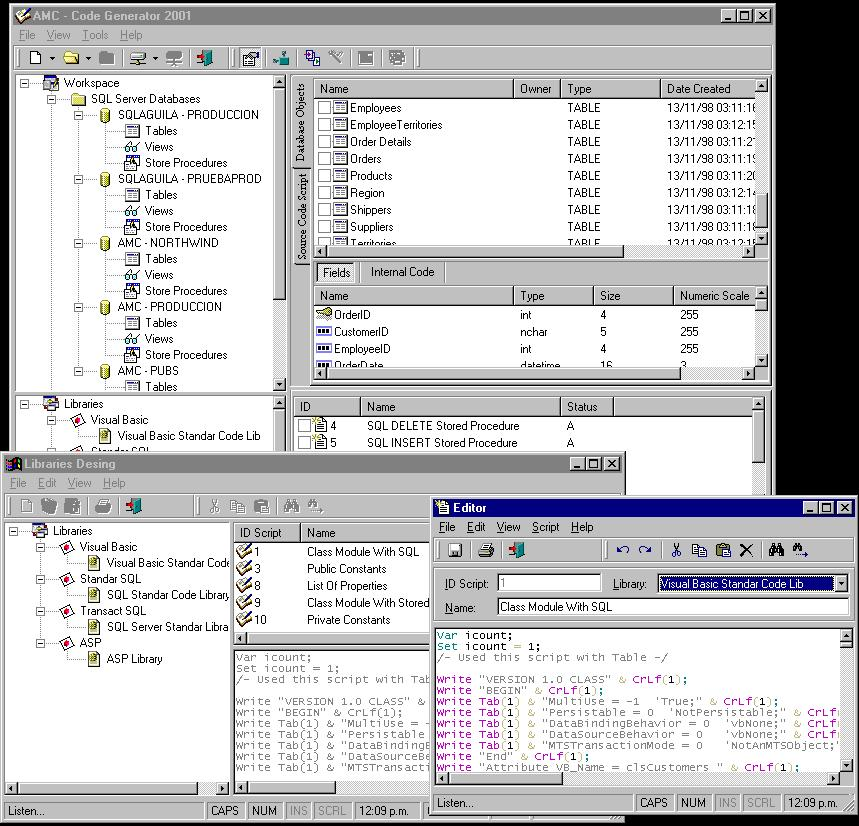



## Full AMC Code Generator 2001

### Description

(About the author)

     It is a generator of source code,

it contains an own language of scripts

and generates code for any programming language.

A publisher of librerias of scripts contains

with which organizacion allows one better.

This single version supports the data base SQLServer 6,5, 7,0 and 2000.

It generates code for VB, ASP and SQL, a complete publisher with SintaxHighlight.
 
### More Info
 

             |
---                |---
**Submitted On**   |2001-09-21 10:15:34
**By**             |[Alfredo Martinez C\.](https://github.com/Planet-Source-Code/PSCIndex/blob/master/ByAuthor/alfredo-martinez-c.md)
**Level**          |Advanced
**User Rating**    |4.8 (53 globes from 11 users)
**Compatibility**  |VB 6\.0
**Category**       |[Complete Applications](https://github.com/Planet-Source-Code/PSCIndex/blob/master/ByCategory/complete-applications__1-27.md)
**World**          |[Visual Basic](https://github.com/Planet-Source-Code/PSCIndex/blob/master/ByWorld/visual-basic.md)
**Archive File**   |[Full AMC C267539212001\.zip](https://github.com/Planet-Source-Code/alfredo-martinez-c-full-amc-code-generator-2001__1-27440/archive/master.zip)

